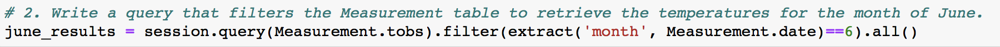

# surfs_up

## Overview
In this project, we are helping W. Avy to dive into the temperature trends before opening the surf shop in Oahu. We will be using Jupyter Notebook for the weather analysis based on the weather data stored in SQLite database given by W. Avy. We are mainly focusing on determining the summary statistics for June and December from 2010 to 2016.

## Results
- The very first thing to do before analyzing the weather date, we would need to import all the dependencies. Dependencies are easy to set up and faster for us to apply in code, which the previously written snippets of code save us tons of time. In this project, we will need Matplotlib, NumPy, Pandas, SQLAlchemy dependencies. Please see Figure 1 for detailed dependencies that we would use for this project.
  
  Figure 1: Dependencies
- Once we retrieve all the temperatures for the month of June, we can use .describe() function to get the summary statistics for the June temperature. Please see Figure 2 for details. As Figure 2 shown, the maxium temperature is 85, the minimum temperature is 64, and the average temperature is 74.9. Our conclusion would be it is a good month for people to go surfing since 80s could be too hot and 60s could be too cold, that the most comfortable temperature in which to surf would be around 70s. 
  
  Figure 2: June Temperature Summary Statistics
- Last, we retrieve all the temperatures for the month of December, we can use .describe() function to get the summary statistics for the December temperature. Please see Figure 3 for details. As Figure 3 shown, the maximum temperature is 83, the minimum temperature is 56, and the average temperature is 71.0. This month isn’t too bad comparing the average temperature of December to the average temperature of June, except that the minimum temperature of December could be cold for surfing.
  
  Figure 3: December Temperature Summary Statistics

## Summary
In order to get the temperature of June/December, we would need to create a variable to store the results of each query. We use session.query() function, and it takes one parameter—Measurement.tobs, for temperature. Then, we would need to filter out all the data that is not June/December, so we use the filter() function to filter out the data we don’t need. In the filter() function we use extract all the month except for June/December. Last, we add a function that extracts all of the results from the query and put them ion a list—adding .all() at the end of our query. Please see Figure 4 and Figure 5 for the queries for June and December.
  
  Figure 4: June Query
  
  Figure 5: December Query
  This is how we reach our final result, and now we will present the summary to W. Avy. As mentioned earlier, these two month would be good timing for people to go surfing since the temperature is most comfortable. However, another thing we must put into consideration is the weather. If it is too windy, the wave might not be safe for surfers to go on that day. In addition, if it is rainning, W. Avy also mentioned that it affects the surf shop. Yet, by looking at our two summary statistics, we can see that Oahu offers pleasant temperature year round since the average stays around 70s. At the end, the temperature is good in Oahu but we would recommend W. Avy to do more research on the weather before making the decision to open the surf shop.
